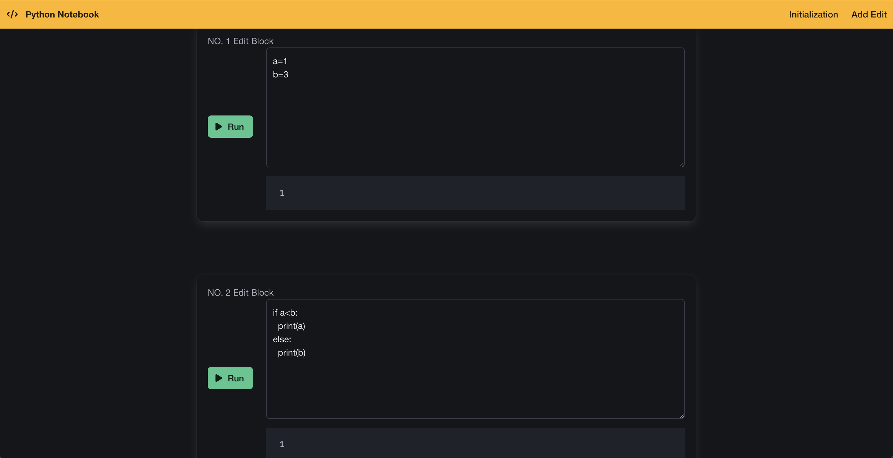

# Python Notebook
參考Jupyter Notebook的功能，嘗試打造一個可在線即時執行Python程式碼的編輯平台。

## 壹、基本說明
**一、目標：**
本平台致力於重現Jupyter Notebook的核心功能，讓使用者能透過瀏覽器即時撰寫與執行Python程式碼，免除繁複的本地環境配置。系統架構主要分為前端與後端兩部分，前端提供類似Jupyter Notebook的操作介面，後端則負責作為程式直譯的核心，處理程式碼的執行邏輯。

**二、開發環境：**
1. 以下是後端開發該平台所採用的環境：
* 虛擬機：Docker
* 程式語言：Python
* RESTful API框架：FastAPI
* 資料庫：Redis(主要作為紀載不同使用者提交的程式碼)
* 程式編輯器：Visual Studio Code

2. 以下是前端開發該平台所採用的環境：
* 虛擬機：Docker
* 程式語言：JavaScript
* JavaScript執行環境：Node.js
* Node.js資源管理工具：npm
* 前端工具庫：React.js
* 程式編輯器：Visual Studio Code

**三、使用相依套件：**
1. 後端平台所採用的套件：
* fastapi(RESTful API框架)
* pydantic(資料驗證與設定)
* uvicorn(ASGI伺服器)
* cors(跨域資源共享)

2. 前端平台所採用的套件：
* bulma(css框架)
* fortawesome(字體和圖示工具套件)

**四、對於RESTful API請求：** 
以下是此後端平台提供的RESTful API端點，包含對應的http方法、路徑及參數說明，如下所示：
* `POST` /initialize-global-variables：初始化使用者的全域變數
* `POST` /execute：執行程式碼(請求內容有userID跟code)

**五、檔案說明：** 
此專案檔案（指coding這個資料夾）主要分為兩個資料夾：Backend和Frontend。其中，Backend資料夾為後端平台的主要程式碼，Frontend資料夾則為前端平台的部分主要程式碼。接下來將對各資料夾中的檔案內容進行詳細說明。
1. Backend
* main.py：為RESTful API的主要程式碼。

2. Frontend(請以React.js創建專案，並覆蓋src資料夾以下的這兩檔案)
* index.js：應用程式的進入點，有別於原本檔案，加入了引入套件指令。
* app.js：主要呈現的網頁內容。

## 貳、操作說明
由於前後端採用不同的系統架構，其安裝方式亦有所差異，具體操作如下所示：
1. 後端平台
* 安裝Redis
```shell
apt update
apt install redis-server
service redis-server start
```
* 安裝fastapi、pydantic、uvicorn、redis 
```shell
pip install fastapi pydantic uvicorn redis 
```
* 運行後端(將 main.py 檔案下載至本機，並根據以下指示執行)
```shell
uvicorn main:app --reload 
```
3. 前端平台
* 安裝fontawesome套件
```shell
npm install @fortawesome/fontawesome-svg-core
npm install @fortawesome/free-solid-svg-icons
npm install @fortawesome/react-fontawesome
``` 
* 安裝React開發環境
```shell
npx create-react-app <專案名稱>
cd <專案名稱>
npm start
```
* 運行後端：將index.js和app.js檔案下載至本機React.js專案中的src資料夾，並根據以下指示執行。

**二、運行結果：**
在完成前後端架構建置後，以下為系統實際的網頁呈現畫面。
<br>
  <div align="center">
  	
  </div>
<br>
